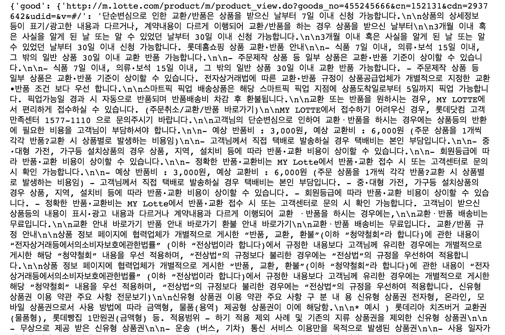

# SKT-WORKS-INTERNSHIP
___

## About

2018_SKT_WORKS_INTERNSHIP

Crawling_by_Spark

Do Crawling based on Spark Distributed Processing, However, there is no marit to Crawling, but It's not in Bigdata env.

We use the Spark Processing to Crawling. so Manage Our CPU Core resources.

there is a growing demand for information to process large amounts of data[text or image].

## Getting Started
Big data processing for large url data.

## Getting Started

### Spark Crawling Step
* Take Dataset from some Cooperations with SKT
  * using Take a CALL & GET data.
* Preprocessing  image using Mask-RCNN
  * using url labeling -> good or bad detect
  * using divide data into RDD structures in local for Analysis
  * using `Crawling_using_Python.py` split url dataset & Crawl them.
* Parsing HTML tags
  * using BeautifulSoup & Newspapers Package. parsing in local.
* Save CSV file from 1 url data.
* Visualize results
  * None.


###  Spark


We use the Spark Distribute System to extract Performance in Crawling.
And There's second way to crawl, like multiprocessing, queue, etc..


If you want to know more about the above Tool, please refer to the link below.

* [Spark](https://spark.apache.org/)
* [Crawler](https://ko.wikipedia.org/wiki/%EC%9B%B9_%ED%81%AC%EB%A1%A4%EB%9F%AC)
* [Multiprocessing](https://ko.wikipedia.org/wiki/%EB%8B%A4%EC%A4%91_%EC%B2%98%EB%A6%AC)


### Dataset

urllist like below
* https://www.naver.com/
* https://www.daum.net/
* https://www.google.com/


### Prerequisites
* Spark2.3.1
* jre-1.8.0
* conda 4.5.6
* Centos version 7
* Tmux
* OpenVPN
* Vim Editor

### spark configuration
* master node with 1 slave nodes
* ssh, ip configuration(secret)
* spark configuration
  * master(secret)
  * slave(secret)


#### setting distributed node


you can edit this file(/etc/host).

```
sudo nano /etc/hosts
```

### make slave node

make slaves file in conf

```
cp slaves-templete slaves
```

### option setup. like number of core

edit spark-env.sh

```
cp spark-env.sh.templete spark-env.sh
vi spark-env.sh
```

fill 
"export JAVA_HOME=/usr/lib/jvm/jre-1.8.0
"export SPARK_WORKER_CORES=3"


### Spark-submit

```
spark-submit --master spark:masterID ~/$file
```


> Crawled Output

 ** Output Captured Screen **

<table>
  <tr>
    <td>
     
    </td>
  </tr>
</table>


#### Additional Technology
* tmux
* openvpn
* sbin & bin - difference
* anaconda env
